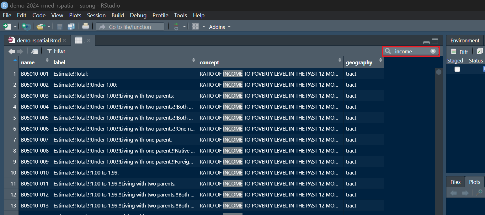

# A. Setup and Primer
## A.1. Install Packages

First, please install any of the following packages required for this tutorial that you have not yet installed.
```{r install_packages, eval = F}
# Spatial packages
install.packages("tidycensus")
install.packages("sf")
install.packages("ggspatial")
# Data importing, wrangling, and plotting packages
install.packages("tidyverse")
install.packages("readr")
install.packages("patchwork")
```

## A.2. Load Packages

Load the following packages that we will use in this tutorial. These packages give us functions to help with the following:

- `tidycensus`: importing Census data
- `sf`: working with and mapping spatial data
- `ggspatial`: mapping north arrow and scale bar
- `tidyverse`: data wrangling
- `readr`: importing CSV files
- `patchwork`: combining multiple maps

```{r load_packages, message = F}
# Spatial packages
library(tidycensus) 
library(sf) 
library(ggspatial) 
# Data importing, wrangling, and plotting packages
library(tidyverse) 
library(readr) 
library(patchwork) 
```

## A.3. Obtain and Load Census API Key

In order to use the tidycensus package, we will need to load the Census API key with the `tidycensus::census_api_key()` function. You can will need to obtain and API key [here](https://api.census.gov/data/key_signup.html). 
```{r load_censusapi, eval = F}
tidycensus::census_api_key("[PASTE CENSUS API KEY HERE]", install = TRUE)
```


## A.4. Primer to Tutorial Syntax

When referring to a new function for the first time, we will use the double colon operator (`::`) to specify the source package of the function. For example, `dplyr::filter()` refers to the `filter()` function from the dplyr package, which is used to subset rows in a data frame that meets certain conditions (i.e., where Species is setosa).
```{r primer_doublecolon}
data(iris) # This loads the iris dataset

dplyr::filter(iris, Species == 'setosa')
```

In this tutorial, we will use data wrangling functions from the [tidyverse](https://www.tidyverse.org/) collection of packages and [pipes](https://r4ds.had.co.nz/pipes.html) (`%>%`) from the magrittr package in order to clearly express sequences of steps. Piping allows us to read the code from top --> bottom rather than inside --> out.
```{r primer_pipes}
# Without pipes
head(dplyr::select(dplyr::filter(iris, Species == 'setosa'), Sepal.Length, Sepal.Width))

# With pipes
iris %>% 
  dplyr::filter(Species == 'setosa') %>% 
  dplyr::select(Sepal.Length, Sepal.Width) %>% 
  head()
```

## A.5. Set Root Directory

This code is needed so that the relative paths used in the data importing later in this code can be the same when running the code individually and knitting this RMarkdown file.

```{r setup_path}
knitr::opts_knit$set(root.dir = "..")
```


# B. Explore Available Census Data
You can get a list of variable names and descriptions from the U.S. Census using the `load_variables()` function from the tidycensus package. Since we are interested in the year 2021, let's use the American Community Survey (vs. the Decennial Census data). We will use the 5-year ACS estimates and filter to variables that are available at the Census tract level.

```{r load_censusvars}
variables_2021_tract <- tidycensus::load_variables(
    year = 2021, 
    dataset = "acs5", 
    cache = TRUE) %>% 
  dplyr::filter(geography == "tract")
variables_2021_tract %>% head()
```

The `str_detect()` function from the stringr package allows us to search text strings for key words. We can use it to find the variable names related to median household income and educational attainment.

- *Median household income*: We can see that the variables B06011_001 is an estimate for the median household income for the total population

```{r search_income}
variables_2021_tract %>% 
  dplyr::filter(concept %>% stringr::str_detect('MEDIAN INCOME'))
```


- *#Educational attainment*: We can see that the variables B06009_001, B06009_002, B06009_003, B06009_004, B06009_005 are estimates related to educational attainment (B06009_002 for less than high school, B06009_003 for high school graduate, B06009_003 for some college, B06009_004 for bachelor's, and B06009_005 for graduate) for the total population

```{r search_edu}
variables_2021_tract %>% 
  dplyr::filter(concept %>% stringr::str_detect('EDUCATION'))
```


We can also use the RStudio IDE to search the variables.

```{r search_view}
variables_2021_tract %>% view()
```

The `view()` function opens up the variables_2021_tract data frame containing all of the variable descriptions in a new tab. In the example below, we search for variables related to "income" by using the search bar on the top right hand side of the window.




# C. Importing Data
## C.1. Census data

To download ACS data using the `get_acs()` function, we need three pieces of information. 

- First, what do we want our geography to be? What's our unit of analysis? 
For this we have decided to use the Census tracts of New York State. See a full list of available geographies here: https://walker-data.com/tidycensus/articles/basic-usage.html#geography-in-tidycensus

- Second, what variables do we want? We can pull those directly in using the same command line. We can even give it our own titles. 

- Third, what year of data do we want? There's room for that too! 

Let's use median income in the past 12 months (B06011_001) and educational attainment (B06009_001, B06009_002, B06009_003, B06009_004, B06009_005). 

### C.1.1. Tabular Census Data

```{r import_census_table}
acs_data_prelim <- get_acs(
  geography = "tract",
  variables = c(hhincome = "B06011_001", 
                total_education = "B06009_001", 
                education_lessthanhs = "B06009_002", 
                education_hs = "B06009_003", 
                education_somecollege = "B06009_004", 
                education_bachelors = "B06009_005"),
  state = "NY",
  year = 2021,
  output = "wide")

acs_data_prelim %>% head()

# Check: The above command brings in the data as a dataframe, which means there is no geometry attached
class(acs_data_prelim)

```

### C.1.2. Spatial Census Data

Now first we downloaded the ACS data using tidycensus, but it was just a dataframe. This means there was no spatial component attached. The good news about get_acs() is that we can also ask it to bring in geometries -- an essential tool to make a map!

```{r import_census_geo, results = F}
acs_data_geo_prelim <- get_acs(
    geography = "tract",
    variables = c(hhincome = "B06011_001",
                  total_education = "B06009_001", 
                  education_lessthanhs= "B06009_002", 
                  education_hs = "B06009_003", 
                  education_somecollege = "B06009_004", 
                  education_bachelors = "B06009_005"),
    state = "NY",
    year = 2021,
    output = "wide", 
    geometry = TRUE) # To also bring in geometries, add in the geometry = TRUE function
  
acs_data_geo_prelim %>% view()
plot(acs_data_geo_prelim)
```


## C.2. PLACES Data (health outcomes)

The [PLACES data](https://www.cdc.gov/places/index.html) was prepared by the Centers for Disease Control and Prevention (CDC), Robert Wood Johnson Foundation, and the CDC Foundation. 

You can use the `sf::st_read()` function in order to import spatial data files into R. You can see that the file imported is a "simple feature", which is a spatial data format in R.

```{r import_places_spatial}
places_sf <- sf::st_read('data/places2023-spatial/places2023.shp')
```

We have prepared a subset of the data in a CSV file that contains only the coronary heart disease (CHD) prevalence for the state of New York. We will use the `readr::read_csv()` function to join this tabular data with the spatial Census data that we imported earlier.

```{r import_places_table}
places_prelim <- readr::read_csv("data/places2023_ny_chd.csv")
```

# D. Cleaning Data

## D.1. Census
First, convert educational attainment counts to proportions in the Census data.
```{r clean_census, echo = F}
# Tabular
acs_data <- acs_data_prelim %>%
  dplyr::transmute(
    GEOID = GEOID,
    hhincome = hhincomeE,
    perc_lessthanhs = (education_lessthanhsE / total_educationE),
    perc_hs = (education_hsE / total_educationE),
    perc_somecollege = (education_somecollegeE / total_educationE),
    perc_bachelors = (education_bachelorsE / total_educationE))

# Spatial
acs_data_geo <- acs_data_geo_prelim %>% 
  dplyr::transmute(
    GEOID = GEOID,
    hhincome = hhincomeE,
    perc_lessthanhs = (education_lessthanhsE / total_educationE),
    perc_hs = (education_hsE / total_educationE),
    perc_somecollege = (education_somecollegeE / total_educationE),
    perc_bachelors = (education_bachelorsE / total_educationE))
```

## D.2. PLACES

Next, we can looking at the column data types in the Census and PLACES data frames using the `str()` functions. We can see that the unique identifier for each Census tract, GEOID, is a character column in the Census data but a numeric column in the PLACES data.
```{r datatypes}
acs_data_geo %>% str()
places_prelim %>% str()
```

We will join the Census and PLACES data together by GEOID, so we will need to convert GEOID in the PLACES data to a character column since GEOID will need to be the same data type for a successful table join.
```{r clean_places}
places <- places_prelim %>% 
  dplyr::transmute(GEOID = GEOID %>% as.character(),
                   chd_prev)
```


## D.2. Merge Data

Use the `dplyr::left_join()` function in order to conduct a table join for the geographic Census data with the PLACES data.
```{r merge}
merged <- acs_data_geo %>% 
  dplyr::left_join(places, by = 'GEOID')
```


# E. Exploring the Data

### E.1. A Snapshot of 2021

Let's begin by exploring the data. We can do that with `summary()` function or a variety of data visualization techniques. 

A histogram visually represents the distribution of a dataset by grouping data into bins and displaying the frequency of data points within each bin.
```{r histogram}
# Explore data
acs_data %>% 
  dplyr::select(perc_lessthanhs, perc_hs, perc_somecollege, perc_bachelors) %>% 
  summary()

# Histogram for distribution of population with less than high school education across census tracts
plot_hist <- ggplot(acs_data, aes(x = perc_lessthanhs)) +
  geom_histogram(binwidth = 0.03, fill = "lightblue", color = "black", alpha = 0.7) +
  theme_minimal() +
  labs(title = "Distribution of Population with Less Than High School Education",
       x = "Percentage",
       y = "Frequency")

plot_hist

```

A box plot, or box-and-whisker plot, displays the distribution of a dataset by showing its median, quartiles, and potential outliers.

```{r boxplot}
# Boxplot for percentage of population with a  high school degree across census tracts
plot_box <- ggplot(acs_data, aes(y = perc_lessthanhs)) +
  geom_boxplot(fill = "blue", color = "black", alpha = 0.5) +
  theme_minimal() +
  labs(title = "Boxplot of Population with Less Than High School Education",
       y = "Percentage")

plot_box

```

A bar plot represents categorical data with rectangular bars, where the height or length of each bar is proportional to the value it represents.

```{r barplot}
# Bar plots for percentages

# Reshape the data for easier plotting
education_data <- acs_data %>%
  select(GEOID, perc_lessthanhs, perc_hs, perc_somecollege, perc_bachelors) %>%
  pivot_longer(cols = starts_with("perc_"), names_to = "education_level", values_to = "proportion")

print(head(education_data))
summary(education_data$proportion)


# Bar plot for educational attainment percentages
plot_bar <- education_data %>% 
  dplyr::group_by(education_level) %>% 
  dplyr::summarize(mean_proportion = mean(proportion, na.rm = TRUE)) %>% 
  ggplot(aes(x = education_level, y = mean_proportion, fill = education_level)) +
  geom_bar(stat = 'identity', color = "black", alpha = 0.7) +
  theme_minimal() +
  labs(title = "Educational Attainment Proportions",
       x = "Education Level",
       y = "Proportion") +
  theme(legend.position = "none")

plot_bar

```

### E.2. Range of Data: Median Household Income from 2009 to 2021

```{r range}
# Define the years of interest
years <- 2017:2021

# Define the variables from above
variables <- c(hhincome = "B19013_001")

# Download data for multiple years
  # Function to download ACS data for a given year
get_acs_data <- function(year) {
  get_acs(
    geography = "tract",
    variables = variables,
    state = "NY",
    year = year,
    output = "wide",
    geometry = FALSE) %>%
    mutate(year = year)  # Add a column for the year
}

# Download data for all years and combine into one data frame
acs_data_list <- lapply(years, get_acs_data)
acs_data_all_years <- bind_rows(acs_data_list)

acs_data_all_years %>% head()

# Check the structure of the combined data
acs_data_all_years %>% str()

# Plotting median household income over the years
  # There are over 4,000 census tracts so let's aggregate and plot averages
average_income <- acs_data_all_years %>%
  group_by(year) %>%
  summarise(avg_hhincome=mean(hhincomeE, na.rm=TRUE))
income_overtime <- ggplot(average_income, aes(x=year, y=avg_hhincome))+
  geom_line(color="blue") +
  geom_point(color="blue")+
  theme_minimal()+
  labs(title="Average Median Household Income Over Time in NY (2009-2021)", 
       x="Year", 
       y= "Average Median Household Income")

income_overtime

```

# F. Mapping the Data

Use the `ggplot::geom_sf()` in order to plot the Census tract boundaries for New York. 
```{r map_boundaries}
merged %>% 
  ggplot() +
  ggplot2::geom_sf()

```

## F.1. Creating a Choropleth Map for a Single Variable

A choropleth map is a thematic map in which areas are shaded or patterned in proportion to the value of a variable being represented. This type of map is commonly used to visualize how a measurement varies across a geographic area, such as population density or median income.

### ... Adding in a variable to create choropleth map
In `ggplot::geom_sf()`, use the `fill` argument in the `aes()` function to specify a variable that you would like to visualize In our example, we are visualizing the geographic distribution of those who have a percentage high school education.
```{r map_choropleth}
smap_1 <- merged %>% 
  ggplot() +
  geom_sf(aes(fill = hhincome))

smap_1
```

### ... Change legend colors
Use the `low` and `high` arguments in the `scale_fill_continuous()` to specify colors to use for low and high values on a continuous scale. 
```{r map_fill}
smap_2 <- smap_1 + 
  scale_fill_continuous(low = 'white', high = 'blue')

smap_2
```

### ... Changing map theme
Use the `theme_void()` function to remove the background and axis marks.
```{r map_theme}
smap_3 <- smap_2 +
  theme_void()

smap_3
```

### ... add a title
Use the `title` argument in the `labs()` function in order to create a title for the map.
```{r map_title}
smap_4 <- smap_3 +
  labs(title = 'Median Household Income in New York')

smap_4
```


### ... adding in a north arrow and scale bar
Use the `annotation_north_arrow()` and `annotation_scale()` functions from the ggspatial package to add in a north arrow and scalebar to the map - best practices when building a map.

- The `location = tl` argument in `annotation_north_arrow()` function is used to place the north arrow on the top left area of the map.
- The `unit_category = 'imperial'` argument in `annotation_scale()` function is used to change the units in the scale bar from metric to imperial units (showing miles instead of kilometers).
```{r map_arrrowscale}
smap_5 <- smap_4 +
  ggspatial::annotation_north_arrow(location = 'tl') + # tl for top-left
  ggspatial::annotation_scale(unit_category = 'imperial') # imperial units to show miles instead of km

smap_5
```


### Putting it all together
We can create the map using the previous functions in one step.
```{r map_single}
smap <- merged %>% 
  ggplot() +
  ggplot2::geom_sf() +
  geom_sf(aes(fill = hhincome)) + 
  scale_fill_continuous(low = 'white', high = 'blue') + 
  theme_void() +
  labs(title = 'Median Household income in New York') +
  ggspatial::annotation_north_arrow(location = 'tl') +
  ggspatial::annotation_scale(unit_category = 'imperial')

smap
```


## F.2. Creating Choropleth Maps for Multiple Variables

### Prepare long dataset with CHD and educational variables
Long datasets are easier to use with ggplot2. 

A long dataset, also known as a "tidy" dataset, is structured so that each row represents a single observation, with one column for each variable and an additional column for the values. This format is often used for time series or repeated measures data.

In contrast, a wide dataset has a format where each row represents a single subject or entity, with multiple columns for different measurements or observations taken at different times or under different conditions. This format is common in datasets where comparisons across different time points or conditions are needed.

We use the `tidyr::pivot_longer()` function in order to create one column for the values of the CHD and educational attainment variables in our dataset.
```{r map_long}
merged_long <- merged %>% 
  tidyr::pivot_longer(cols = c(chd_prev, perc_lessthanhs, perc_hs, perc_somecollege, perc_bachelors),
                      names_to = 'variable_name',
                      values_to = 'value') 
```

### Create a Facet Plot
Use the `facet_wrap()` function to create a facet plot (allows us to create multiple maps in a grid) for our 5 variables. We use the `ncol = 3` argument to specify that we would like to create a grid of maps with 3 columns.
```{r map_facet}
multmap_1 <- merged_long %>% 
  ggplot() +
  ggplot2::geom_sf() +
  geom_sf(aes(fill = value)) +
  facet_wrap(vars(variable_name), ncol = 3)

```

### ... Adding in different legend colors, theme, title, north arrow, and scalebar
Use the same functions as we used with the single variable choropleth map in order to add different legend colors, theme, a title, a north arrow, and a scalebar. Use the `height` and `width` arguments in the `ggspatial::annotation_north_arrow()` function in order to change the size of the north arrow.
```{r map_prevsteps}
multmap_2 <- multmap_1 +
  scale_fill_continuous(low = 'white', high = 'blue') +
  theme_void() +
  labs(title = 'CHD Prevalence and Educational Attainment in New York') +
  ggspatial::annotation_north_arrow(location = 'tl', height = unit(0.5, "cm"), width = unit(0.5, "cm"),
                                    style = north_arrow_orienteering(text_size = 1)) +
  ggspatial::annotation_scale(unit_category = 'imperial')

multmap_2
```

### Putting it all together
We can create the map using the previous functions in one step. 
```{r map_mult}
multmap <- merged_long %>% 
  ggplot() +
  ggplot2::geom_sf() +
  geom_sf(aes(fill = value)) +
  facet_wrap(vars(variable_name), ncol = 3) + 
  scale_fill_continuous(low = 'white', high = 'blue') + 
  theme_void() +
  labs(title = 'CHD Prevalence and Educational Attainment in New York') +
  ggspatial::annotation_north_arrow(location = 'tl', height = unit(0.5, "cm"), width = unit(0.5, "cm"),
                                    style = north_arrow_orienteering(text_size = 1)) +
  ggspatial::annotation_scale(unit_category = 'imperial')

multmap
  
```

## F.3. Combining Multiple Maps

Using the patchwork package, we can use the `/` operator to stack our previously created maps, one on top of the other. The map below is only a quick example. When producing a map to share, you would want to change the north arrow, scalebar, and text sizes.
```{r map_comb}
smap / multmap
```

# G. Additional Resources
In case you would like to learn more about geocomputation, data wrangling, or the tidycensus package, here are some additional resources:

- [Geocomputation with R (free online book)](https://r.geocompx.org/)
- [R for Data Science (free online book)](https://r4ds.hadley.nz/)
- [Vignette for the tidycensus package](https://walker-data.com/tidycensus/articles/basic-usage.html)
